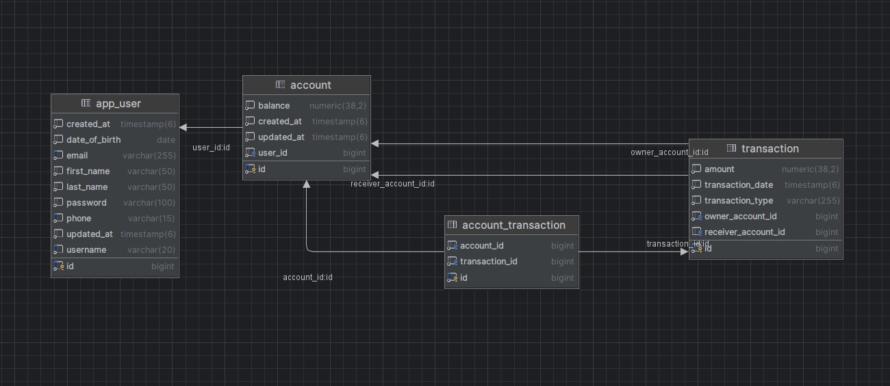

# Banking Application

## Introduction

This project is a banking application that allows users to manage their accounts and transactions. Users can create accounts, deposit or withdraw money, and transfer funds between accounts. The system ensures that all transactions are secure and that users can only access their own data.

The project is built using Java 17 and Spring Boot version 3.3.2, leveraging various Spring modules such as Spring Data JPA for database interaction, Hibernate as the ORM framework, and other technologies like Jakarta Validation API, and PostgreSQL. Lombok is used to reduce boilerplate code.

Spring Security will be added in the future to enhance the application's security.

As a computer engineering student, I created this small project to reinforce what I have learned and to explore new concepts.

## API Endpoints

### User Endpoints

- **POST /api/users**
  - Creates a new user.
  - Request Body: `UserCreateDTO`
  - Response: `UserResponseDTO`

- **GET /api/users/{id}**
  - Retrieves a user by ID along with their associated accounts.
  - Path Parameter: `id` (Long)
  - Response: `UserResponseDTO`

- **DELETE /api/users/{id}**
  - Deletes a user by ID.
  - Path Parameter: `id` (Long)

- **PUT /api/users/{id}/username**
  - Updates the username of a user.
  - Path Parameter: `id` (Long)
  - Request Body: `UpdateUsernameDTO`

- **PUT /api/users/{id}/password**
  - Updates the password of a user.
  - Path Parameter: `id` (Long)
  - Request Body: `UpdatePasswordDTO`

- **PUT /api/users/{id}/email**
  - Updates the email of a user.
  - Path Parameter: `id` (Long)
  - Request Body: `UpdateEmailDTO`

### Account Endpoints

- **POST /api/accounts**
  - Creates a new account.
  - Request Body: `AccountCreateDTO`
  - Response: `AccountResponseDTO`

- **GET /api/accounts/{id}**
  - Retrieves an account by ID.
  - Path Parameter: `id` (Long)
  - Response: `AccountResponseDTO`

- **DELETE /api/accounts/{id}**
  - Deletes an account by ID.
  - Path Parameter: `id` (Long)

### Transaction Endpoints

- **POST /api/transactions/deposit**
  - Deposits money into an account.
  - Request Body: `TransactionRequestDTO`

- **POST /api/transactions/withdraw**
  - Withdraws money from an account.
  - Request Body: `TransactionRequestDTO`

- **POST /api/transactions/transfer**
  - Transfers money from one account to another.
  - Request Body: `TransferRequestDTO`

- **GET /api/transactions/{id}**
  - Retrieves all transactions for a given account ID.
  - Path Parameter: `id` (Long)
  - Response: List of `Transaction`

## Diagram

